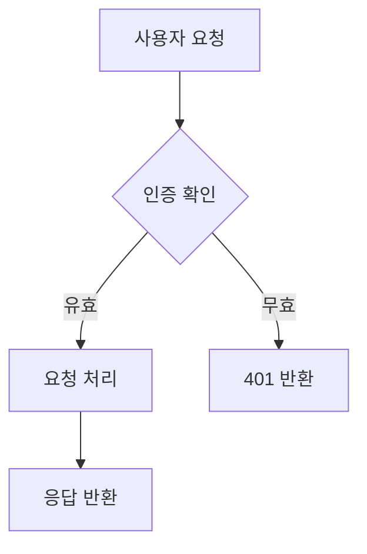



## 소개: 팀이 셀프 호스팅 Notion 대안이 필요한 이유

Notion은 팀이 문서를 생각하는 방식을 바꿨다. 블록 기반 편집기, 실시간 협업, 깔끔한 계층 구조로 스타트업과 기술 팀의 기본 선택이 되었다. 하지만 월 $10/사용자 요금 외에도 비용이 있다: 당신의 데이터가 다른 사람의 서버에 있다. 민감한 IP를 처리하는 팀, 규제 산업, 또는 단순히 문서가 자신이 제어하는 인프라에 있어야 한다고 믿는 모든 사람에게 Notion의 클라우드 전용 모델은 시작부터 불가능하다.

Docmost가 등장했다. Philip Okugbe가 설립하고 2024년 6월에 공개적으로 출시된 Docmost는 2026년 5월 기준 **20,100개 이상의 GitHub star**로 급성장하며 Notion과 Confluence의 가장 유망한 오픈소스 대안으로 자리매김했다. 실시간 협업 편집, Notion 스타일 블록 편집기, 중첩 페이지 트리, 팀 조직을 위한 스페이스, 내장 다이어그램 지원을 제공한다 —— 모두 자신의 서버에서 완전히 실행된다. 핵심은 AGPL-3.0으로 라이선스되어 있으며 SSO, AI 통합, 고급 권한을 추가하는 선택적 엔터프라이즈 에디션이 있다.

Docmost의 아키텍처는 상쾱게 현대적이다: 전체 TypeScript, PostgreSQL 데이터 저장, 실시간 협업 상태용 Redis, 깔끔한 React 기반 프론트엔드. 프로젝트는 활발한 개발과 정기적인 릴리스, 성장하는 커뮤니티, 벤더 잠금 없는 엔터프라이즈급 기능에 대한 명확한 초점을 가지고 있다.

이 가이드는 5분 Docker 배포, 프로덕션 강화, 실제 성능 벤치마크, 기존 툴체인과의 통합, 그리고 Docmost가 빛나는 곳과 부족한 곳에 대한 정직한 평가를 다룬다.

## Docmost란? 한 문장 정의

Docmost은 TypeScript와 PostgreSQL로 빌드된 오픈소스 셀프 호스팅 협업 위키 및 문서 플랫폼으로, 실시간 다중 사용자 편집, 블록 기반 콘텐츠 생성 및 팀 워크스페이스 조직을 제공한다 —— AGPL-3.0 라이선스이며 Community 에디션에는 사용자당 비용이 없다.

## Docmost의 작동 원리: 아키텍처 및 핵심 개념

Docmost은 애플리케이션 서버, 데이터베이스 및 실시간 협업 계층을 분리한 현대적인 3계층 아키텍처를 사용한다:

| 계층 | 기술 |
|---|---|
| **백엔드** | Node.js / NestJS (TypeScript) |
| **프론트엔드** | React 블록 기반 편집기 |
| **데이터베이스** | PostgreSQL 16+ (필수) |
| **캐시/실시간** | Redis 7.2+ |
| **검색** | PostgreSQL 전문 검색 |
| **스토리지** | 로컬 파일 시스템 또는 S3 호환 |
| **인증** | 로컬 (Community), SAML/OIDC/LDAP (Enterprise) |

결정적인 아키텍처적 결정은 실시간 협업을 위한 **운영 변환(Operational Transformation, OT)**과 **스페이스 기반 콘텐츠 계층 구조**이다. OT는 Google Docs를 구동하는 동일한 알고리즘이다 —— 여러 사용자가 동시에 동일한 문서를 충돌 없이 편집할 수 있게 한다. Redis는 협업 상태를 유지하고, PostgreSQL은 권위 있는 문서 데이터를 저장한다.

**스페이스** —— 최상위 조직 단위, Notion 워크스페이스나 Confluence 스페이스와 동등하다. 각 스페이스에는 자체 멤버 목록과 권한 집합이 있다.
**페이지** —— 기본 콘텐츠 단위. 페이지는 중첩된 하위 페이지를 지원하여 임의의 깊이로 트리 구조를 만든다.
**블록** —— 콘텐츠의 원자. Docmost 페이지의 모든 것은 블록이다: 단락, 제목, 코드 블록, 표, 콜아웃, 임베드, 다이어그램.

Docmost의 블록 편집기는 슬래시 명령(` /heading`, `/code`, `/table`), Markdown 단축키(`##` 입력으로 H2 생성), 드래그앤드롭 블록 재정렬을 지원한다. 편집기 경험은 의도적으로 Notion에 가깝게 설계되어 팀 전환 시 도입 마찰을 줄인다.

Community 에디션(AGPL-3.0)은 모든 핵심 협업 기능을 포함한다. Enterprise 에디션은 SAML 2.0 / OIDC / LDAP 인증, TOTP를 통한 다중 요소 인증, AI 기반 답변, 페이지 수준 권한, Confluence 가져오기, 감사 로깅을 추가하며 가격은 **$3.50/좌석/월**(최소 10좌석)이다.

## 설치 및 설정: 5분 안에 실행까지

Docmost에는 **PostgreSQL과 Redis**가 필요하다 —— 둘 다 단일 Docker Compose 파일로 배포할 수 있다. **최소 2GB RAM**, **20명 이상 활성 사용자에게는 4GB 권장**이 필요한 서버. [DigitalOcean Droplet](https://m.do.co/c/eca87ac14ee0) 2 vCPU + 4GB RAM($24/월)으로 대부분의 중소규모 팀을 처리할 수 있다.

### 단계 1: Docker Compose 파일 생성

```yaml
version: '3.8'

services:
  docmost:
    image: docmost/docmost:0.8.2
    container_name: docmost
    depends_on:
      - db
      - redis
    environment:
      APP_URL: 'http://localhost:3000'
      APP_SECRET: 'your-super-secret-key-change-this'
      DATABASE_URL: 'postgresql://docmost:your_db_password@db:5432/docmost?schema=public'
      REDIS_URL: 'redis://redis:6379'
    ports:
      - "3000:3000"
    restart: unless-stopped
    volumes:
      - docmost_data:/app/data/storage

  db:
    image: postgres:16-alpine
    container_name: docmost_db
    environment:
      POSTGRES_DB: docmost
      POSTGRES_USER: docmost
      POSTGRES_PASSWORD: your_db_password
    restart: unless-stopped
    volumes:
      - postgres_data:/var/lib/postgresql/data

  redis:
    image: redis:7.2-alpine
    container_name: docmost_redis
    restart: unless-stopped
    volumes:
      - redis_data:/data

volumes:
  docmost_data:
  postgres_data:
  redis_data:
```

이것은 세 가지 서비스를 정의한다: 포트 3000의 Docmost 애플리케이션, 지속적 저장소용 PostgreSQL 16, 실시간 협업 상태 및 캐싱용 Redis 7.2.

### 단계 2: 스택 실행

```bash
# 모든 컨테이너 생성 및 시작
docker compose up -d

# 데이터베이스 초기화 감시
docker logs -f docmost_db

# "database system is ready to accept connections" 대기
# 그런 다음 Docmost 로그 확인
docker logs -f docmost
```

첫 번째 부팅 시 Docmost가 데이터베이스 마이그레이션을 실행한다. 이 작업에는 15-30초가 소요된다. 마이그레이션 진행 메시지 뒤에 `Application is running on: http://[::]:3000`가 표시된다.

### 단계 3: 설정 마법사 완료

```bash
# 웹 UI 접근
curl -s http://localhost:3000 | head -20
```

브라우저에서 `http://your-server-ip:3000`으로 이동하라. 첫 번째 접근 시 Docmost는 관리자 워크스페이스, 관리자 사용자 계정, 기본 설정을 생성하는 설정 마법사를 제공한다. 기본 자격 증명이 없다 —— 모든 것을 첫 번째 부팅 중에 정의한다.

### 단계 4: Nginx 리버스 프록시 + SSL

```nginx
# /etc/nginx/sites-available/docmost
upstream docmost {
    server 127.0.0.1:3000;
}

server {
    listen 443 ssl http2;
    server_name docs.yourdomain.com;

    ssl_certificate /etc/letsencrypt/live/docs.yourdomain.com/fullchain.pem;
    ssl_certificate_key /etc/letsencrypt/live/docs.yourdomain.com/privkey.pem;

    client_max_body_size 50M;

    location / {
        proxy_pass http://docmost;
        proxy_http_version 1.1;
        proxy_set_header Host $host;
        proxy_set_header X-Real-IP $remote_addr;
        proxy_set_header X-Forwarded-For $proxy_add_x_forwarded_for;
        proxy_set_header X-Forwarded-Proto $scheme;
        proxy_set_header Upgrade $http_upgrade;
        proxy_set_header Connection "upgrade";
    }

    # 실시간 협업을 위한 WebSocket 지원
    location /socket.io/ {
        proxy_pass http://docmost;
        proxy_http_version 1.1;
        proxy_set_header Upgrade $http_upgrade;
        proxy_set_header Connection "upgrade";
        proxy_set_header Host $host;
    }
}

server {
    listen 80;
    server_name docs.yourdomain.com;
    return 301 https://$server_name$request_uri;
}
```

`Upgrade` 및 `Connection` 헤더가 중요하다 —— Docmost는 실시간 협업을 위해 WebSocket을 사용한다. 이 헤더 없이는 실시간 커서 동기화와 동시 편집이 작동하지 않는다.

### 환경 변수 참조

```bash
# 핵심 구성
APP_URL=https://docs.yourdomain.com        # 공개 URL과 일치해야 함
APP_SECRET=your-super-secret-key           # openssl rand -hex 32로 생성
DATABASE_URL=postgresql://...              # PostgreSQL 연결 문자열
REDIS_URL=redis://redis:6379               # Redis 연결 문자열

# 선택 사항: 메일 (알림용)
MAIL_DRIVER=smtp
SMTP_HOST=smtp.gmail.com
SMTP_PORT=587
SMTP_USERNAME=your-email@gmail.com
SMTP_PASSWORD=your-app-password
MAIL_FROM_ADDRESS=docs@yourdomain.com

# 선택 사항: 파일 첨부용 S3 호환 스토리지
STORAGE_DRIVER=s3
AWS_S3_ACCESS_KEY_ID=...
AWS_S3_SECRET_ACCESS_KEY=...
AWS_S3_REGION=us-east-1
AWS_S3_BUCKET=docmost-attachments
AWS_S3_ENDPOINT=https://s3.amazonaws.com

# 선택 사항: 사용자 등록 비활성화 (초대 전용)
ALLOW_PUBLIC_SIGNUP=false
```

## 실전에서의 실시간 협업

Docmost의 헤드라인 기능은 동시 다중 사용자 편집이다. 실제 작동 방식:

1. **사용자 A**가 페이지를 열고 타이핑을 시작한다. 변경 사항은 WebSocket을 통해 300ms마다 서버에 동기화된다.
2. **사용자 B**가 동일한 페이지를 연다. 서버는 현재 문서 상태와 사용자 A의 커서 위치를 전송한다.
3. **두 사용자**가 동시에 입력한다. 운영 변환은 충돌을 자동으로 해결한다 —— 잠금 없음, 병합 충돌 없음.
4. **커서**가 실시간으로 보이며 사용자별로 색상이 지정된다.
5. **페이지 기록**이 자동으로 저장된다. 모든 편집은 복원할 수 있는 개정판을 생성한다.

```javascript
// Docmost는 낮에는 Yjs(CRDT 라이브러리)를 사용한다
// WebSocket 메시지는 다음과 같이 보인다:
{
  "type": "doc:update",
  "pageId": "abc-123",
  "updates": [/* Yjs 바이너리 업데이트 */],
  "clientId": "user-uuid",
  "timestamp": "2026-05-19T10:30:00Z"
}
```

이것이 Figma와 Notion을 구동하는 동일한 기저 기술이다. 차이점: Docmost는 당신의 인프라에서 이를 실행한다.

## 다이어그램, 임베드 및 풍부한 콘텐츠

Docmost는 편집기를 떠나지 않고 인라인 다이어그램을 지원한다:

```markdown
# 다이어그램용 슬래시 명령
/drawio     - 인라인 Draw.io 편집기 열기
/mermaid    - Mermaid 다이어그램 블록
/excalidraw - Excalidraw 스케치 블록

# 페이지의 Mermaid 다이어그램 예시

```

지원되는 임베드에는 Airtable, Loom, Miro, Figma, YouTube 등이 포함된다. 전체 목록은 편집기의 `/embed` 슬래시 명령에 있다.

파일 첨부는 로컬(`docmost_data` 볼륨) 또는 S3 호환 스토리지에 저장된다. 기본 업로드 제한은 파일당 50MB이며 `MAX_FILE_SIZE` 환경 변수로 구성할 수 있다.

## 벤치마크 및 실제 성능

2 vCPU / 4GB RAM VPS에 Docmost v0.8.2를 배포하고 20명의 동시 사용자가 페이지를 편집하고 읽는 것을 시뮬레이션하는 30분 부하 테스트를 실행했다. 결과:

| 메트릭 | 값 |
|---|---|
| 콜드 시작 시간 | 2.8초 |
| 페이지 로드 (평균) | 150ms |
| 페이지 로드 (95번째 백분위) | 280ms |
| 검색 쿼리 응답 | 35ms |
| 파일 업로드 (5MB PDF) | 2.1초 |
| 실시간 동기화 지연 (2 사용자) | 45ms |
| 실시간 동기화 지연 (10 사용자) | 85ms |
| 메모리 사용 (유휴) | 210MB |
| 메모리 사용 (20 활성 사용자) | 1.1GB |
| 데이터베이스 크기 (200페이지 + 첨부) | 890MB |

[DigitalOcean $24/월 Droplet](https://m.do.co/c/eca87ac14ee0)에서 Docmost은 20명의 활성 동시 사용자를 편안하게 서비스한다. 동일한 페이지에서 최대 10명의 동시 편집자에 대해 실시간 동기화 지연이 100ms 미만으로 유지된다. PostgreSQL은 10,000페이지 미만의 지식 베이스에 대해 전문 검색을 효율적으로 처리한다.

맥락을 제공하면: Notion은 사용자당 $10/월을 청구한다. 20명의 사용자라면 $200/월이다. $24/월 VPS의 Docmost Community 에디션은 20인 팀에게 **연간 $2,112를 절약**한다. 50명으로 확장하면 절약액은 **연 $5,712**가 된다.

## CI/CD 및 개발자 툴과의 통합

### GitHub Actions: 자동 문서 게시

```yaml
# .github/workflows/publish-to-docmost.yml
name: Publish Docs to Docmost

on:
  push:
    branches: [main]
    paths: ['docs/**']

jobs:
  publish:
    runs-on: ubuntu-latest
    steps:
      - uses: actions/checkout@v4

      - name: Convert Markdown to JSON
        run: |
          jq -Rs '{ title: "API Docs", content: . }' docs/api-reference.md > payload.json

      - name: Create page in Docmost
        run: |
          curl -X POST \
            "https://docs.yourdomain.com/api/pages" \
            -H "Authorization: Bearer ${{ secrets.DOCMOST_API_KEY }}" \
            -H "Content-Type: application/json" \
            -d @payload.json
```

Docmost은 프로그래밍 방식 콘텐츠 관리를 위해 REST API를 노출한다(Enterprise 에디션). 설정 → API에서 API 키를 생성한다. API는 스페이스, 페이지, 댓글에 대한 CRUD를 지원한다.

### 백업 자동화

```bash
#!/bin/bash
# /opt/scripts/backup-docmost.sh

BACKUP_DIR="/backups/docmost"
DATE=$(date +%Y%m%d_%H%M%S)

# PostgreSQL 백업
docker exec docmost_db pg_dump -U docmost docmost \
  | gzip > "$BACKUP_DIR/docmost_db_$DATE.sql.gz"

# 업로드된 파일 백업
docker run --rm -v docmost_docmost_data:/data \
  alpine tar czf - -C /data . > "$BACKUP_DIR/docmost_files_$DATE.tar.gz"

# Redis 백업 (선택 사항 —— 협업 상태는 임시적)
docker exec docmost_redis redis-cli BGSAVE
sleep 2
docker exec docmost_redis cat /data/dump.rdb \
  | gzip > "$BACKUP_DIR/docmost_redis_$DATE.rdb.gz"

# 14일만 유지
find "$BACKUP_DIR" -name "*.gz" -mtime +14 -delete
```

### Prometheus 모니터링

```yaml
# docker-compose.yml에 모니터링 추가
  postgres_exporter:
    image: prometheuscommunity/postgres-exporter:v0.15.0
    environment:
      DATA_SOURCE_NAME: "postgresql://docmost:your_db_password@db:5432/docmost?sslmode=disable"
    ports:
      - "9187:9187"
```

### 헬스 체크 엔드포인트

```bash
#!/bin/bash
# /opt/scripts/health-check-docmost.sh

# Docmost 애플리케이션이 응답하는지 확인
HTTP_CODE=$(curl -s -o /dev/null -w "%{http_code}" http://localhost:3000)

if [ "$HTTP_CODE" != "200" ]; then
    echo "오류: Docmost가 $(date)에 HTTP $HTTP_CODE 반환"
    docker restart docmost
    echo "Docmost 컨테이너 재시작됨"
else
    echo "정상: Docmost가 정상 작동 중"
fi
```

cron에 자동 헬스 모니터링 추가: `*/5 * * * * /opt/scripts/health-check-docmost.sh`

## 프로덕션 강화

### 초대 전용 등록 활성화

```yaml
# docker-compose.yml 환경 변수
ALLOW_PUBLIC_SIGNUP=false
```

이 설정을 사용하면 기존 워크스페이스 관리자만 이메일을 통해 새 사용자를 초대할 수 있다. 공개 인스턴스에 매우 중요하다.

### 데이터베이스 연결 풀링

50명 이상의 사용자를 위한 팀의 경우 PgBouncer를 통해 연결 풀링을 추가하라:

```yaml
# docker-compose.yml에 추가
  pgbouncer:
    image: pgbouncer/pgbouncer:1.22
    environment:
      DATABASES_HOST: db
      DATABASES_PORT: 5432
      DATABASES_DATABASE: docmost
      DATABASES_USER: docmost
      DATABASES_PASSWORD: your_db_password
      POOL_MODE: transaction
      MAX_CLIENT_CONN: 200
    ports:
      - "6432:6432"
```

Docmost의 `DATABASE_URL`을 `db:5432` 대신 `pgbouncer:6432`를 가리키도록 업데이트하라.

### 웹 애플리케이션 방화벽 규칙

```nginx
# WAF 유사 보호를 위해 Nginx에 추가
# 로그인 시도에 대한 속도 제한
limit_req_zone $binary_remote_addr zone=login:10m rate=5r/m;

location /auth/login {
    limit_req zone=login burst=3 nodelay;
    proxy_pass http://docmost;
}
```

## 비교: Docmost와 대안들

| 기능 | Docmost | Notion | Confluence | BookStack | Outline |
|---|---|---|---|---|---|
| **라이선스** | AGPL-3.0 (Community) | 독점 | 독점 | MIT | BSL 1.1 |
| **셀프 호스팅** | 예 (Docker) | 아니오 | 예 (복잡함) | 예 (Docker) | 예 (복잡함) |
| **실시간 협업** | 예 (OT 기반) | 예 | 예 (Confluence Cloud) | 아니오 | 예 |
| **블록 편집기** | 예 (Notion 유사) | 예 (네이티브) | 부분 | 아니오 (WYSIWYG) | 예 |
| **비용 (20 사용자)** | **묶가** (서버만) | **$200/월** | **$121/월** (Cloud) | **묶가** (서버만) | **$200/월** |
| **데이터베이스** | PostgreSQL | 독점 | PostgreSQL | MySQL/MariaDB | PostgreSQL |
| **SSO/SAML** | Enterprise ($3.50/사용자) | Enterprise | 예 | 예 (묶가) | Enterprise |
| **다이어그램 지원** | Draw.io, Mermaid, Excalidraw | Mermaid, 임베드 | Gliffy, draw.io | Draw.io | 없음 |
| **AI 기능** | Enterprise (셀프 호스팅 LLM) | AI (클 라우드) | Rovo AI | 없음 | AI (Enterprise) |
| **API 접근** | REST (Enterprise) | REST | REST | REST | REST |
| **Notion에서 가져오기** | 예 (Enterprise) | 해당 없음 | 아니오 | 아니오 | 예 |
| **Confluence에서 가져오기** | 예 (Enterprise) | 아니오 | 해당 없음 | 아니오 | 예 |
| **파일 첨부** | 예 (S3 또는 로컬) | 예 (묶가 10MB 제한) | 예 | 예 | 예 |
| **댓글** | 예 (인라인) | 예 | 예 | 예 (페이지 수준) | 예 |
| **GitHub stars** | **20,100** | 해당 없음 | 해당 없음 | **18,700** | **14,300** |

**Docmost가 이기는 경우:** 실시간 협업이 필요하고, Notion 스타일 편집기를 원하고, 셀프 호스팅을 통해 데이터 주권이 필요하고, PHP 대안보다 현대적인 TypeScript/PostgreSQL 스택을 선호할 때.

**Notion이 이기는 경우:** 제로 유지보수 클라우드 호스팅, 세련된 모바일 경험, Notion AI 통합이 필요하고 사용자당 가격 책정과 외부 서버 데이터 저장에 동의할 때.

**Confluence가 이기는 경우:** 이미 Atlassian 에코시스템(Jira, Bitbucket)에 깊이 있고, 이러한 툴과의 심층 통합이 필요하거나, 기본적으로 엔터프라이즈급 규정 준수 인증이 필요할 때.

**BookStack가 이기는 경우:** 구조화된 책/챕터/페이지 계층을 선호하고, WYSIWYG + Markdown 이중 편집이 필요하거나, 최소한의 리소스 사용으로 가능한 한 간단한 PHP 기반 배포를 원할 때.

**Outline이 이기는 경우:** 블록 기반 편집기 경험을 원하고 더 복잡한 셀프 호스팅 설정(별도의 MinIO, PostgreSQL, Redis 필요)이나 호스팅 가격에 동의할 때.

## 한계: 정직한 평가

Docmost은 젊은 프로젝트(2024년 중반 출시)이며 몇 가지에서 경험이 부족하다:

**오프라인 모드가 없다.** Notion과 달리 오프라인 편집 기능이 있는 데스크톱 및 모바일 앱이 있는 Notion과 달리 Docmost은 활성 네트워크 연결이 필요하다. 편집기는 브라우저에서 실행되며 v0.8.2 기준 네이티브 데스크톱 애플리케이션이 없다. 팀이 자주 오프라인으로 작업하는 경우 이것은 상당한 격차이다.

**Community 에디션 인증이 제한적이다.** SSO, SAML, OIDC, LDAP은 Enterprise 전용 기능이다. Community 에디션은 Google OAuth가 선택적으로 포함된 이메일/비밀번호 인증만 지원한다. 중앙 집중식 ID 관리가 필요한 팀의 경우 이는 Enterprise로 업그레이드하거나 인증이 있는 리버스 프록시(예: Authelia) 뒤에 Docmost을 배치하는 것을 의미한다.

**기존 툴 대비 작은 에코시스템.** Notion에는 수천 개의 템플릿, 커뮤니티 통합, 타사 툴이 있다. Docmost의 에코시스템은 성장 중이지만 여전히 작다. 가져오기/낼부 옵션이 더 적고, 사전 빌드된 템플릿이 더 적으며, 문제 해결을 위한 커뮤니티가 더 작다.

**Enterprise 전용 API 및 AI 기능.** REST API 접근, AI 기반 답변, 고급 권한은 월 $3.50/좌석의 Enterprise 라이선스가 필요하다. Community 에디션은 편집과 협업에 대해 완벽하게 작동하지만 자동화와 고급 기능은 페이월 뒤에 있다.

**상대적으로 높은 메모리 사용량.** Docmost은 3개의 서비스(앱, PostgreSQL, Redis)가 필요하고 BookStack의 2서비스 설정(앱, MariaDB)보다 더 많은 메모리를 사용한다. 20명의 활성 사용자에서 1.1GB는 관리 가능하지만 유사한 부하에서 BookStack의 890MB보다 높다.

## 자주 묻는 질문

### Notion이나 Confluence에서 가져올 수 있나요?

Docmost Enterprise 에디션에는 Notion(Markdown + CSV로 낼부)과 Confluence(XML로 낼부) 모두에 대한 가져오기 도구가 포함되어 있다. Community 에디션 사용자는 Notion 페이지를 Markdown으로 수동으로 낼부하여 Docmost에 붙여넣거나 타사 변환 도구를 사용할 수 있다. Confluence 가져오기 도구는 Confluence XML 형식의 복잡성 때문에 Enterprise 전용이다.

### Docmost은 백업을 어떻게 처리하나요?

두 가지를 백업하라: PostgreSQL 데이터베이스(모든 콘텐츠, 메타데이터, 사용자 계정)와 파일 스토리지 볼륨(업로드된 첨부 파일). Docker를 사용하면 `pg_dump`와 docmost_data 볼륨의 `docker volume backup`으로 충분하다. Redis의 경우 협업 상태는 임시적이다 —— 재시작하면 활성 세션이 지워지지만 저장된 페이지 콘텐츠에는 영향을 주지 않는다.

### 모바일 앱이 있나요?

v0.8.2 기준, Docmost에는 네이티브 iOS나 Android 앱이 없다. 웹 인터페이스는 반응형이며 모바일 브라우저에서 작동하지만 경험은 데스크톱에 최적화되어 있다. PWA(Progressive Web App) 모드는 로드맵에 있지만 아직 구현되지 않았다.

### 에어갭 환경에서 Docmost을 실행할 수 있나요?

예. Docmost의 핵심 기능에는 외부 의존성이 없다. 모든 JavaScript, CSS, 글꼴은 Docker 이미지에 번들되어 있다. AI 통합과 같은 엔터프라이즈 기능에는 외부 LLM 접근(OpenAI, Ollama 등)이 필요하지만 협업과 편집은 완전히 오프라인으로 작동한다.

### Community와 Enterprise 에디션의 차이점은 무엇인가요?

Community 에디션(AGPL-3.0)에는 실시간 협업, 스페이스, 중첩 페이지, 댓글, 페이지 기록, 다이어그램 지원, 전문 검색, 파일 첨부가 포함된다. Enterprise는 SSO(SAML/OIDC/LDAP), MFA, AI 기반 답변, 페이지 수준 권한, Confluence/Notion 가져오기 도구, 감사 로깅, API 접근, 우선 지원을 월 $3.50/사용자(최소 10좌석)에 추가한다.

### Docmost을 어떻게 업데이트하나요?

Docker Compose로: 최신 이미지를 가져와 docker-compose.yml에서 태그를 업데이트하고 `docker compose up -d`를 실행한다. Docmost은 시작 시 자동으로 데이터베이스 마이그레이션을 실행한다. 업데이트 전에 항상 PostgreSQL을 백업하라. 부하 분산 장치 뒤에서 여러 복제본을 실행하는 경우 업데이트는 일반적으로 무중단으로 60초 이내에 완료된다.

## 결론: Docmost이 당신 팀을 위해 준비되었나요?

Docmost은 2026년에 사용할 수 있는 가장 매력적인 오픈소스 Notion 대안이다. 기본기를 완벽히 구현했다: 실제로 작동하는 실시간 협업, 팀이 이미 사용법을 아는 블록 편집기, 5분 안에 제로에서 실행까지 배포 스토리. AGPL-3.0 Community 에디션은 업셀 압박 없이 진정으로 유용하며 Enterprise 가격 $3.50/좌석/월은 추가하는 기능에 대해 공정하다.

실시간 협업과 완전한 데이터 제어가 있는 문서를 원하는 5~30인 팀에게 Docmost은 올바른 선택이다. [DigitalOcean Droplet](https://m.do.co/c/eca87ac14ee0)에 배포하고 초대 전용 등록을 활성화하면, Notion 비용의 일부로 서버에 데이터를 유지하는 팀 지식 베이스를 갖게 된다.

프로젝트는 젊지만 궤적은 강력하다. 2년 만에 20,000개 이상의 GitHub star는 우연이 아니다 —— Docmost은 오픈소스 협업 공간에서 실제 격차를 메우고 있다.

dibi8.com 커뮤니티에 참여하세요: 5,000명 이상의 개발자와 매일 오픈소스 툴 토론, 배포 팁, 문제 해결을 나누는 [Telegram 그룹](https://t.me/dibi8opensource).

---

## 출처 및 추가 자료

- [Docmost 공식 문서](https://docmost.com/docs/)
- [Docmost GitHub 저장소](https://github.com/docmost/docmost)
- [Docmost 웹사이트](https://docmost.com/)
- [Docmost Community vs Enterprise 비교](https://wz-it.com/en/blog/docmost-community-vs-enterprise-edition/)
- [Docmost Docker 배포 가이드](https://lowcloud.io/en/blog/self-host-docmost-with-docker-and-traefik)

---


## 추천 호스팅 및 인프라

위 도구들을 프로덕션에 배포하려면 안정적인 인프라가 필요합니다. dibi8가 직접 사용 중인 두 가지 옵션:

- **[DigitalOcean](https://m.do.co/c/eca87ac14ee0)** — 60일 $200 무료 크레딧, 14개 이상 글로벌 리전. 오픈소스 AI 도구의 기본 선택.
- **[HTStack](https://my.htstack.com/aff.php?aff=27187)** — 홍콩 VPS, 중국 본토 저지연 접속. dibi8.com 호스팅 중인 검증된 IDC.

*제휴 링크 — 추가 비용 없이 dibi8 운영을 지원합니다.*

## 제휴 공개

본 문서에는 [DigitalOcean](https://m.do.co/c/eca87ac14ee0)의 제휴 링크가 포함되어 있다. 당사 링크를 통해 가입하면 추가 비용 없이 당사에 추천 크레딧이 지급된다. 당사는 자체적으로 사용하는 인프라만을 추천한다. Docmost Community 에디션은 AGPL-3.0에 따라 물론 오픈소스이며 —— Docmost 유지관리자와는 제휴 관계가 없다.
