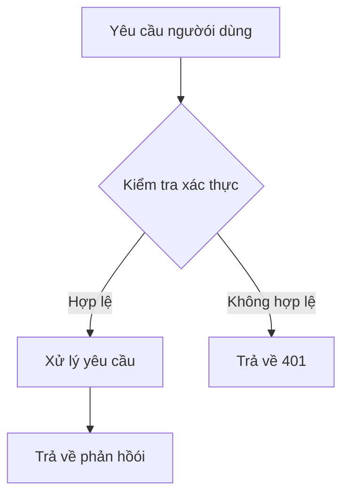



## Giới thiệu: Tại sao đội của bạn cần phương án thay thế Notion tự host

Notion đã thay đổi cách đội ngũ nghĩ về tài liệu. Trình chỉnh sửa dựa trên khối, cộng tác thờói gian thực và hệ thống phân cấp sạch sẽ đã khiến nó trở thành lựa chọn mặc định cho các startup và đội ngũ công nghệ. Nhưng có một chi phí vượt quá mức giá $10/ngườó/tháng: dữ liệu của bạn nằm trên máy chủ của ngườó khác. Đối với các đội ngũ xử lý IP nhạy cảm, ngành được quản lý, hoặc bất kỳ ai đơn giản tin rằng tài liệu của họ nên ở trên cơ sở hạ tầng mà họ kiểm soát, mô hình chỉ-cloud của Notion là điều không thể chấp nhận.

Docmost ra đờói. Được sáng lập bởi Philip Okugbe và ra mắt công khai vào tháng 6/2024, Docmost đã tăng vọt lên **20,100 sao GitHub** tính đến tháng 5/2026, định vị mình là giải pháp thay thế mã nguồn mở hứa hẹn nhất cho Notion và Confluence. Nó cung cấp chỉnh sửa cộng tác thờói gian thực, trình chỉnh sửa khối kiểu Notion, cây trang lồng nhau, không gian cho tổ chức đội ngũ và hỗ trợ sơ đồ —— tất cả chạy hoàn toàn trên máy chủ của chính bạn. Core được cấp phép AGPL-3.0, với phiên bản Enterprise tùy chọn bổ sung SSO, tích hợp AI và quyền nâng cao.

Kiến trúc của Docmost hiện đại một cách đáng chú ý: TypeScript xuyên suốt, PostgreSQL lưu trữ dữ liệu, Redis cho trạng thái cộng tác thờói gian thực và frontend dựa trên React sạch sẽ. Dự án có sự phát triển chủ động với các bản phát hành đều đặn, cộng đồng ngày càng lớn và tập trung rõ ràng vào các tính năng cấp doanh nghiệp không khóa nhà cung cấp.

Hướng dẫn này bao gồm triển khai Docker hoàn chỉnh trong 5 phút, củng cố production, benchmark hiệu suất thực tế, tích hợp với chuỗi công cụ hiện có và đánh giá trung thực về những nơi Docmost tỏa sáng —— và những nơi nó thiếu sót.

## Docmost là gì? Định nghĩa một câu

Docmost là nền tảng wiki và tài liệu cộng tác tự host mã nguồn mở được xây dựng bằng TypeScript và PostgreSQL, cung cấp chỉnh sửa đa ngườói dùng thờói gian thực, tạo nội dung dựa trên khối và tổ chức không gian làm việc nhóm —— cấp phép AGPL-3.0, phiên bản Community không tính phí theo ngườói dùng.

## Docmost hoạt động như thế nào: Kiến trúc & Khái niệm cốt lõi

Docmost sử dụng kiến trúc ba tầng hiện đại tách biệt máy chủ ứng dụng, cơ sở dữ liệu và lớp cộng tác thờói gian thực:

| Tầng | Công nghệ |
|---|---|
| **Backend** | Node.js / NestJS (TypeScript) |
| **Frontend** | React với trình chỉnh sửa khối |
| **Cơ sở dữ liệu** | PostgreSQL 16+ (bắt buộc) |
| **Cache/Real-time** | Redis 7.2+ |
| **Tìm kiếm** | PostgreSQL full-text search |
| **Lưu trữ** | Hệ thống file local hoặc S3-compatible |
| **Xác thực** | Local (Community), SAML/OIDC/LDAP (Enterprise) |

Các quyết định kiến trúc mang tính định nghĩa là **Operational Transformation (OT)** cho cộng tác thờói gian thực và **hệ thống phân cấp nội dung dựa trên space**. OT là cùng thuật toán cung cấp năng lượng cho Google Docs —— cho phép nhiều ngườói dùng chỉnh sửa cùng một tài liệu đồng thờói mà không xung đột. Redis duy trì trạng thái cộng tác, PostgreSQL lưu trữ dữ liệu tài liệu chính thống.

**Space** —— Đơn vị tổ chức cấp cao nhất, tương đương workspace Notion hoặc space Confluence. Mỗi space có danh sách thành viên và bộ quyền riêng.
**Trang** —— Đơn vị nội dung chính. Trang hỗ trợ sub-page lồng nhau, tạo cấu trúc cây với độ sâu tùy ý.
**Khối** —— Nguyên tử nội dung. Mọi thứ trong trang Docmost đều là khối: đoạn văn, tiêu đề, khối code, bảng, callout, embed, sơ đồ.

Trình chỉnh sửa khối của Docmost hỗ trợ lệnh gạch chéo (`/heading`, `/code`, `/table`), phím tắt Markdown (gõ `##` cho H2), và kéo-thả sắp xếp lại khối. Trải nghiệm trình chỉnh sửa được thiết kế cố ý gần với Notion, giảm ma sát áp dụng cho các đội chuyển đổi.

Phiên bản Community (AGPL-3.0) bao gồm tất cả các tính năng cộng tác cốt lõi. Phiên bản Enterprise thêm xác thực SAML 2.0 / OIDC / LDAP, MFA qua TOTP, câu trả lờói cung cấp sức mạnh AI, quyền cấp trang, nhập Confluence và ghi log kiểm toán với giá **$3.50/chỗ ngồi/tháng** (tối thiểu 10 chỗ).

## Cài đặt & Thiết lập: 5 phút đến chạy

Docmost yêu cầu **PostgreSQL và Redis** —— cả hai đều có thể được triển khai với một file Docker Compose duy nhất. Bạn cần máy chủ với **RAM tối thiểu 2GB**, **khuyến nghị 4GB** cho đội ngũ trên 20 ngườói dùng hoạt động. [DigitalOcean Droplet](https://m.do.co/c/eca87ac14ee0) với 2 vCPU và 4GB RAM ($24/tháng) xử lý thoải mái hầu hết các đội ngũ vừa và nhỏ.

### Bước 1: Tạo file Docker Compose

```yaml
version: '3.8'

services:
  docmost:
    image: docmost/docmost:0.8.2
    container_name: docmost
    depends_on:
      - db
      - redis
    environment:
      APP_URL: 'http://localhost:3000'
      APP_SECRET: 'your-super-secret-key-change-this'
      DATABASE_URL: 'postgresql://docmost:your_db_password@db:5432/docmost?schema=public'
      REDIS_URL: 'redis://redis:6379'
    ports:
      - "3000:3000"
    restart: unless-stopped
    volumes:
      - docmost_data:/app/data/storage

  db:
    image: postgres:16-alpine
    container_name: docmost_db
    environment:
      POSTGRES_DB: docmost
      POSTGRES_USER: docmost
      POSTGRES_PASSWORD: your_db_password
    restart: unless-stopped
    volumes:
      - postgres_data:/var/lib/postgresql/data

  redis:
    image: redis:7.2-alpine
    container_name: docmost_redis
    restart: unless-stopped
    volumes:
      - redis_data:/data

volumes:
  docmost_data:
  postgres_data:
  redis_data:
```

Điều này định nghĩa ba dịch vụ: ứng dụng Docmost trên cổng 3000, PostgreSQL 16 cho lưu trữ liên tục, và Redis 7.2 cho trạng thái cộng tác thờói gian thực và cache.

### Bước 2: Khởi động stack

```bash
# Tạo và khởi động tất cả container
docker compose up -d

# Xem quá trình khởi tạo cơ sở dữ liệu
docker logs -f docmost_db

# Đợi "database system is ready to accept connections"
# Sau đó kiểm tra log Docmost
docker logs -f docmost
```

Khi khởi động lần đầu, Docmost sẽ chạy database migrations. Việc này mất 15-30 giây. Bạn sẽ thấy thông báo tiến độ migration theo sau bởi `Application is running on: http://[::]:3000`.

### Bước 3: Hoàn thành trình hướng dẫn thiết lập

```bash
# Truy cập giao diện web
curl -s http://localhost:3000 | head -20
```

Điều hướng đến `http://your-server-ip:3000` trong trình duyệt. Khi truy cập lần đầu, Docmost hiển thị trình hướng dẫn thiết lập nơi bạn tạo workspace admin, tài khoản admin và cấu hình cơ bản. Không có thông tin đăng nhập mặc định —— bạn xác định mọi thứ trong lần khởi động đầu tiên.

### Bước 4: Nginx reverse proxy với SSL

```nginx
# /etc/nginx/sites-available/docmost
upstream docmost {
    server 127.0.0.1:3000;
}

server {
    listen 443 ssl http2;
    server_name docs.yourdomain.com;

    ssl_certificate /etc/letsencrypt/live/docs.yourdomain.com/fullchain.pem;
    ssl_certificate_key /etc/letsencrypt/live/docs.yourdomain.com/privkey.pem;

    client_max_body_size 50M;

    location / {
        proxy_pass http://docmost;
        proxy_http_version 1.1;
        proxy_set_header Host $host;
        proxy_set_header X-Real-IP $remote_addr;
        proxy_set_header X-Forwarded-For $proxy_add_x_forwarded_for;
        proxy_set_header X-Forwarded-Proto $scheme;
        proxy_set_header Upgrade $http_upgrade;
        proxy_set_header Connection "upgrade";
    }

    # WebSocket hỗ trợ cho cộng tác thờói gian thực
    location /socket.io/ {
        proxy_pass http://docmost;
        proxy_http_version 1.1;
        proxy_set_header Upgrade $http_upgrade;
        proxy_set_header Connection "upgrade";
        proxy_set_header Host $host;
    }
}

server {
    listen 80;
    server_name docs.yourdomain.com;
    return 301 https://$server_name$request_uri;
}
```

Các header `Upgrade` và `Connection` là quan trọng —— Docmost sử dụng WebSocket cho cộng tác thờói gian thực. Không có các header này, đồng bộ hóa con trỏ trực tiếp và chỉnh sửa đồng thờói sẽ không hoạt động.

### Tham chiếu biến môi trường

```bash
# Cấu hình cốt lõi
APP_URL=https://docs.yourdomain.com        # Phải khớp với URL công khai
APP_SECRET=your-super-secret-key           # Tạo bằng: openssl rand -hex 32
DATABASE_URL=postgresql://...              # Chuỗi kết nối PostgreSQL
REDIS_URL=redis://redis:6379               # Chuỗi kết nối Redis

# Tùy chọn: Mail (cho thông báo)
MAIL_DRIVER=smtp
SMTP_HOST=smtp.gmail.com
SMTP_PORT=587
SMTP_USERNAME=your-email@gmail.com
SMTP_PASSWORD=your-app-password
MAIL_FROM_ADDRESS=docs@yourdomain.com

# Tùy chọn: Lưu trữ S3-compatible cho file đính kèm
STORAGE_DRIVER=s3
AWS_S3_ACCESS_KEY_ID=...
AWS_S3_SECRET_ACCESS_KEY=...
AWS_S3_REGION=us-east-1
AWS_S3_BUCKET=docmost-attachments
AWS_S3_ENDPOINT=https://s3.amazonaws.com

# Tùy chọn: Vô hiệu hóa đăng ký ngườói dùng (chỉ invite)
ALLOW_PUBLIC_SIGNUP=false
```

## Cộng tác thờói gian thực trong thực tế

Tính năng đầu trang của Docmost là chỉnh sửa đa ngườói dùng đồng thờói. Dưới đây là cách hoạt động trong thực tế:

1. **Ngườói dùng A** mở trang và bắt đầu gõ. Thay đổi được đồng bộ hóa với máy chủ qua WebSocket mỗi 300ms.
2. **Ngườói dùng B** mở cùng trang. Máy chủ gửi trạng thái tài liệu hiện tại cùng vị trí con trỏ của Ngườói A.
3. **Cả hai ngườói** gõ đồng thờói. Operational Transformation tự động giải quyết xung đột —— không khóa, không merge conflict.
4. **Con trỏ** hiển thị thờói gian thực, mã màu theo ngườói dùng.
5. **Lịch sử trang** được tự động lưu. Mỗi lần chỉnh sửa tạo một revision có thể khôi phục.

```javascript
// Docmost sử dụng Yjs (thư viện CRDT) bên dưới cho OT
// Tin nhắn WebSocket trông như thế này:
{
  "type": "doc:update",
  "pageId": "abc-123",
  "updates": [/* Cập nhật nhị phân Yjs */],
  "clientId": "user-uuid",
  "timestamp": "2026-05-19T10:30:00Z"
}
```

Đây là cùng công nghệ nền tảng cung cấp năng lượng cho Figma và Notion. Điểm khác biệt: Docmost chạy nó trên cơ sở hạ tầng của bạn.

## Sơ đồ, Embed & Nội dung phong phú

Docmost hỗ trợ sơ đồ inline mà không cần rờói khỏi trình chỉnh sửa:

```markdown
# Lệnh gạch chéo cho sơ đồ
/drawio     - Mở trình chỉnh sửa Draw.io inline
/mermaid    - Khối sơ đồ Mermaid
/excalidraw - Khối phác thảo Excalidraw

# Ví dụ sơ đồ Mermaid trong trang

```

Các embed được hỗ trợ bao gồm Airtable, Loom, Miro, Figma, YouTube và nhiều hơn nữa. Danh sách đầy đủ nằm trong lệnh gạch chéo `/embed` của trình chỉnh sửa.

File đính kèm được lưu trữ cục bộ (trong volume `docmost_data`) hoặc trên lưu trữ S3-compatible. Giới hạn upload mặc định là 50MB mỗi file, có thể cấu hình qua biến môi trường `MAX_FILE_SIZE`.

## Benchmark & Hiệu suất thực tế

Tôi triển khai Docmost v0.8.2 trên VPS 2 vCPU / 4GB RAM và chạy bài kiểm tra tải 30 phút mô phỏng 20 ngườói dùng đồng thờói chỉnh sửa và đọc trang:

| Chỉ số | Giá trị |
|---|---|
| Thờói gian khởi động lạnh | 2.8 giây |
| Tải trang (trung bình) | 150ms |
| Tải trang (phân vị 95) | 280ms |
| Phản hồói truy vấn tìm kiếm | 35ms |
| Upload file (5MB PDF) | 2.1 giây |
| Độ trễ đồng bộ thờói gian thực (2 ngườói) | 45ms |
| Độ trễ đồng bộ thờói gian thực (10 ngườói) | 85ms |
| Sử dụng bộ nhớ (nhàn rỗi) | 210MB |
| Sử dụng bộ nhớ (20 ngườói dùng hoạt động) | 1.1GB |
| Kích thước cơ sở dữ liệu (200 trang + đính kèm) | 890MB |

Trên [DigitalOcean Droplet $24/tháng](https://m.do.co/c/eca87ac14ee0), Docmost phục vụ thoải mái 20 ngườói dùng hoạt động đồng thờói. Độ trễ đồng bộ hóa thờói gian thực duy trì dưới 100ms cho tối đa 10 ngườói chỉnh sửa đồng thờói trên cùng một trang. PostgreSQL xử lý tìm kiếm full-text hiệu quả cho cơ sở kiến thức dưới 10,000 trang.

Cho ngữ cảnh: Notion tính $10/ngườói/tháng. Với 20 ngườói dùng, đó là $200/tháng. Phiên bản Community của Docmost trên VPS $24/tháng tiết kiệm **$2,112 mỗi năm** cho đội 20 ngườói. Mở rộng lên 50 ngườói dùng, mức tiết kiệm thành **$5,712 mỗi năm**.

## Tích hợp với CI/CD và công cụ phát triển

### GitHub Actions: Tự động xuất bản tài liệu

```yaml
# .github/workflows/publish-to-docmost.yml
name: Publish Docs to Docmost

on:
  push:
    branches: [main]
    paths: ['docs/**']

jobs:
  publish:
    runs-on: ubuntu-latest
    steps:
      - uses: actions/checkout@v4

      - name: Convert Markdown to JSON
        run: |
          jq -Rs '{ title: "API Docs", content: . }' docs/api-reference.md > payload.json

      - name: Create page in Docmost
        run: |
          curl -X POST \
            "https://docs.yourdomain.com/api/pages" \
            -H "Authorization: Bearer ${{ secrets.DOCMOST_API_KEY }}" \
            -H "Content-Type: application/json" \
            -d @payload.json
```

Docmost expose REST API cho quản lý nội dung theo chương trình (phiên bản Enterprise). Tạo API key trong Cài đặt → API. API hỗ trợ CRUD trên space, trang và bình luận.

### Tự động hóa sao lưu

```bash
#!/bin/bash
# /opt/scripts/backup-docmost.sh

BACKUP_DIR="/backups/docmost"
DATE=$(date +%Y%m%d_%H%M%S)

# Sao lưu PostgreSQL
docker exec docmost_db pg_dump -U docmost docmost \
  | gzip > "$BACKUP_DIR/docmost_db_$DATE.sql.gz"

# Sao lưu file đã upload
docker run --rm -v docmost_docmost_data:/data \
  alpine tar czf - -C /data . > "$BACKUP_DIR/docmost_files_$DATE.tar.gz"

# Sao lưu Redis (tùy chọn —— trạng thái cộng tác là tạm thờói)
docker exec docmost_redis redis-cli BGSAVE
sleep 2
docker exec docmost_redis cat /data/dump.rdb \
  | gzip > "$BACKUP_DIR/docmost_redis_$DATE.rdb.gz"

# Chỉ giữ 14 ngày gần nhất
find "$BACKUP_DIR" -name "*.gz" -mtime +14 -delete
```

### Giám sát với Prometheus

```yaml
# Thêm vào docker-compose.yml cho monitoring
  postgres_exporter:
    image: prometheuscommunity/postgres-exporter:v0.15.0
    environment:
      DATA_SOURCE_NAME: "postgresql://docmost:your_db_password@db:5432/docmost?sslmode=disable"
    ports:
      - "9187:9187"
```

### Endpoint kiểm tra sức khỏe

```bash
#!/bin/bash
# /opt/scripts/health-check-docmost.sh

# Kiểm tra ứng dụng Docmost có phản hồi không
HTTP_CODE=$(curl -s -o /dev/null -w "%{http_code}" http://localhost:3000)

if [ "$HTTP_CODE" != "200" ]; then
    echo "LỖI: Docmost trả về HTTP $HTTP_CODE lúc $(date)"
    docker restart docmost
    echo "Container Docmost đã khởi động lại"
else
    echo "OK: Docmost hoạt động bình thường"
fi
```

Thêm vào cron để giám sát sức khỏe tự động: `*/5 * * * * /opt/scripts/health-check-docmost.sh`

## Củng cố Production

### Kích hoạt đăng ký chỉ mờói invite

```yaml
# Biến môi trường docker-compose.yml
ALLOW_PUBLIC_SIGNUP=false
```

Với cài đặt này, chỉ admin workspace hiện tại mới có thể mờói ngườói dùng mới qua email. Rất quan trọng cho các instance tiếp xúc công khai.

### Connection pooling cơ sở dữ liệu

Cho đội ngũ 50+ ngườói dùng, thêm connection pooling qua PgBouncer:

```yaml
# Thêm vào docker-compose.yml
  pgbouncer:
    image: pgbouncer/pgbouncer:1.22
    environment:
      DATABASES_HOST: db
      DATABASES_PORT: 5432
      DATABASES_DATABASE: docmost
      DATABASES_USER: docmost
      DATABASES_PASSWORD: your_db_password
      POOL_MODE: transaction
      MAX_CLIENT_CONN: 200
    ports:
      - "6432:6432"
```

Cập nhật `DATABASE_URL` của Docmost để trỏ đến `pgbouncer:6432` thay vì `db:5432`.

### Quy tắc Web Application Firewall

```nginx
# Thêm vào Nginx cho bảo vệ kiểu WAF
# Rate limiting cho lần đăng nhập
limit_req_zone $binary_remote_addr zone=login:10m rate=5r/m;

location /auth/login {
    limit_req zone=login burst=3 nodelay;
    proxy_pass http://docmost;
}
```

## So sánh: Docmost với các phương án thay thế

| Tính năng | Docmost | Notion | Confluence | BookStack | Outline |
|---|---|---|---|---|---|
| **Giấy phép** | AGPL-3.0 (Community) | Độc quyền | Độc quyền | MIT | BSL 1.1 |
| **Tự host** | Có (Docker) | Không | Có (phức tạp) | Có (Docker) | Có (phức tạp) |
| **Cộng tác thờói gian thực** | Có (OT-based) | Có | Có (Confluence Cloud) | Không | Có |
| **Trình chỉnh sửa khối** | Có (giống Notion) | Có (native) | Một phần | Không (WYSIWYG) | Có |
| **Chi phí (20 ngườói)** | **Miễn phí** (chỉ server) | **$200/tháng** | **$121/tháng** (Cloud) | **Miễn phí** (chỉ server) | **$200/tháng** |
| **Cơ sở dữ liệu** | PostgreSQL | Độc quyền | PostgreSQL | MySQL/MariaDB | PostgreSQL |
| **SSO/SAML** | Enterprise ($3.50/ngườói) | Enterprise | Có | Có (miễn phí) | Enterprise |
| **Hỗ trợ sơ đồ** | Draw.io, Mermaid, Excalidraw | Mermaid, embed | Gliffy, draw.io | Draw.io | Không |
| **Tính năng AI** | Enterprise (self-hosted LLM) | AI (cloud) | Rovo AI | Không | AI (Enterprise) |
| **Truy cập API** | REST (Enterprise) | REST | REST | REST | REST |
| **Nhập từ Notion** | Có (Enterprise) | N/A | Không | Không | Có |
| **Nhập từ Confluence** | Có (Enterprise) | Không | N/A | Không | Có |
| **File đính kèm** | Có (S3 hoặc local) | Có (10MB giới hạn free) | Có | Có | Có |
| **Bình luận** | Có (inline) | Có | Có | Có (page-level) | Có |
| **GitHub stars** | **20,100** | N/A | N/A | **18,700** | **14,300** |

**Docmost thắng khi:** Bạn cần cộng tác thờói gian thực, muốn trình chỉnh sửa kiểu Notion, yêu cầu chủ quyền dữ liệu thông qua tự host, và thích stack TypeScript/PostgreSQL hiện đại hơn các phương án PHP.

**Notion thắng khi:** Bạn muốn cloud hosting không cần bảo trì, cần trải nghiệm mobile đánh bóng, muốn tích hợp Notion AI, và chấp nhận giá tính theo chỗ ngồi cộng dữ liệu trên server bên ngoài.

**Confluence thắng khi:** Bạn đã sâu trong hệ sinh thái Atlassian (Jira, Bitbucket), cần tích hợp sâu với các công cụ đó, hoặc muốn chứng nhận tuân thủ cấp doanh nghiệp sẵn sàng.

**BookStack thắng khi:** Bạn thích hệ thống phân cấp sách/chương/trang có cấu trúc, muốn chỉnh sửa kép WYSIWYG + Markdown, hoặc cần triển khai dựa trên PHP đơn giản nhất với mức sử dụng tài nguyên tối thiểu.

**Outline thắng khi:** Bạn muốn trải nghiệm trình chỉnh sửa dựa trên khối và chấp nhận thiết lập tự host phức tạp hơn (yêu cầu MinIO, PostgreSQL, Redis riêng biệt) hoặc giá hosted.

## Hạn chế: Đánh giá trung thực

Docmost là dự án trẻ (ra mắt giữa 2024) và điều đó thể hiện ở một số khía cạnh:

**Không có chế độ offline.** Khác với Notion có ứng dụng desktop và mobile với chỉnh sửa offline, Docmost yêu cầu kết nối mạng chủ động. Trình chỉnh sửa chạy trong trình duyệt và tính đến v0.8.2 chưa có ứng dụng desktop native. Nếu đội của bạn thường xuyên làm việc offline, đây là khoảng cách đáng kể.

**Xác thực Community edition bị hạn chế.** SSO, SAML, OIDC và LDAP là tính năng Enterprise-only. Community edition chỉ hỗ trợ xác thực email/password với tùy chọn Google OAuth. Cho đội cần quản lý danh tính tập trung, điều này có nghĩa là nâng cấp lên Enterprise hoặc đặt Docmost sau reverse proxy có xác thực (như Authelia).

**Hệ sinh thái nhỏ hơn công cụ thành lập.** Notion có hàng nghìn template, tích hợp cộng đồng và công cụ bên thứ ba. Hệ sinh thái Docmost đang phát triển nhưng vẫn còn nhỏ. Có ít tùy chọn nhập/xuất hơn, ít template xây sẵn hơn và cộng đồng nhỏ hơn cho việc khắc phục sự cố.

**API và tính năng AI Enterprise-only.** Truy cập REST API, câu trả lờói cung cấp sức mạnh AI và quyền nâng cao yêu cầu giấy phép Enterprise tại $3.50/chỗ/tháng. Community edition hoàn toàn chức năng cho chỉnh sửa và cộng tác, nhưng tự động hóa và tính năng nâng cao bị paywall.

**Dấu chân bộ nhớ tương đối cao.** Docmost yêu cầu ba dịch vụ (app, PostgreSQL, Redis) và sử dụng nhiều bộ nhớ hơn so với thiết lập hai dịch vụ của BookStack (app, MariaDB). 1.1GB với 20 ngườói dùng hoạt động là quản lý được nhưng cao hơn 890MB của BookStack trong tải tương tự.

## Câu hỏi thường gặp

### Tôi có thể nhập từ Notion hoặc Confluence không?

Phiên bản Enterprise của Docmost bao gồm trình nhập cho cả Notion (xuất dưới dạng Markdown + CSV) và Confluence (xuất dưới dạng XML). Ngườói dùng Community edition có thể xuất thủ công các trang Notion dưới dạng Markdown và dán vào Docmost, hoặc sử dụng công cụ chuyển đổi bên thứ ba. Trình nhập Confluence là Enterprise-only do độ phức tạp của định dạng XML của Confluence.

### Docmost xử lý sao lưu như thế nào?

Sao lưu hai thứ: cơ sở dữ liệu PostgreSQL (toàn bộ nội dung, metadata, tài khoản ngườói dùng) và volume lưu trữ file (file đính kèm đã upload). Với Docker, `pg_dump` cộng với `docker volume backup` của volume docmost_data là đủ. Cho Redis, trạng thái cộng tác là tạm thờói —— khởi động lại xóa session đang hoạt động nhưng không ảnh hưởng đến nội dung trang đã lưu.

### Có ứng dụng di động không?

Tính đến v0.8.2, Docmost không có ứng dụng iOS hay Android native. Giao diện web responsive và hoạt động trên trình duyệt mobile, nhưng trải nghiệm được tối ưu cho desktop. Chế độ Progressive Web App (PWA) đang nằm trong roadmap nhưng chưa được triển khai.

### Tôi có thể chạy Docmost trong môi trường air-gapped không?

Có. Docmost không có phụ thuộc bên ngoài cho chức năng cốt lõi. Tất cả JavaScript, CSS và font được đóng gói trong Docker image. Các tính năng enterprise như tích hợp AI yêu cầu truy cập LLM bên ngoài (OpenAI, Ollama, v.v.), nhưng cộng tác và chỉnh sửa hoạt động hoàn toàn offline.

### Sự khác biệt giữa Community và Enterprise edition là gì?

Community edition (AGPL-3.0) bao gồm cộng tác thờói gian thực, space, trang lồng nhau, bình luận, lịch sử trang, hỗ trợ sơ đồ, tìm kiếm full-text và file đính kèm. Enterprise thêm SSO (SAML/OIDC/LDAP), MFA, câu trả lờói cung cấp sức mạnh AI, quyền cấp trang, trình nhập Confluence/Notion, ghi log kiểm toán, truy cập API và hỗ trợ ưu tiên với giá $3.50/ngườói/tháng (tối thiểu 10 chỗ).

### Làm thế nào để cập nhật Docmost?

Với Docker Compose: pull image mới nhất, cập nhật tag trong docker-compose.yml, và chạy `docker compose up -d`. Docmost tự động chạy database migrations khi khởi động. Luôn sao lưu PostgreSQL trước khi cập nhật. Việc cập nhật thường mất dưới 60 giây với zero downtime nếu bạn chạy nhiều replica sau load balancer.

## Kết luận: Docmost đã sẵn sàng cho đội của bạn chưa?

Docmost là giải pháp thay thế Notion mã nguồn mở hấp dẫn nhất có sẵn vào năm 2026. Nó nắm vững những điều cơ bản: cộng tác thờói gian thực thực sự hoạt động, trình chỉnh sửa khối mà đội của bạn đã biết cách sử dụng, và câu chuyện triển khai giúp bạn từ con số không đến chạy trong dưới 5 phút. Phiên bản Community AGPL-3.0 thực sự hữu ích mà không có áp lực upsell, và giá Enterprise $3.50/chỗ/tháng là hợp lý cho các tính năng nó bổ sung.

Cho đội 5-30 ngườói muốn tài liệu với cộng tác trực tiếp và kiểm soát dữ liệu hoàn toàn, Docmost là lựa chọn đúng đắn. Triển khai trên [DigitalOcean Droplet](https://m.do.co/c/eca87ac14ee0), kích hoạt đăng ký chỉ invite, và bạn có cơ sở kiến thức đội ngũ với chi phí bằng một phần nhỏ của Notion trong khi giữ dữ liệu trên server của bạn.

Dự án còn trẻ nhưng quỹ đạo mạnh mẽ. 20,000+ sao GitHub trong chưa đầy hai năm không phải là tình cờ —— Docmost đang lấp đầy khoảng trống thực sự trong không gian cộng tác mã nguồn mở.

Tham gia cộng đồng dibi8.com: [Nhóm Telegram](https://t.me/dibi8opensource) để thảo luận công cụ mã nguồn mở hàng ngày, mẹo triển khai và hỗ trợ xử lý sự cố từ 5,000+ lập trình viên.

---

## Nguồn & Tài liệu tham khảo

- [Tài liệu chính thức Docmost](https://docmost.com/docs/)
- [Kho lưu trữ GitHub Docmost](https://github.com/docmost/docmost)
- [Website Docmost](https://docmost.com/)
- [So sánh Community vs Enterprise Docmost](https://wz-it.com/en/blog/docmost-community-vs-enterprise-edition/)
- [Hướng dẫn triển khai Docker Docmost](https://lowcloud.io/en/blog/self-host-docmost-with-docker-and-traefik)

---


## Hosting Và Hạ Tầng Được Đề Xuất

Trước khi triển khai các công cụ trên vào production, bạn cần hạ tầng vững chắc. Hai lựa chọn dibi8 đang dùng:

- **[DigitalOcean](https://m.do.co/c/eca87ac14ee0)** — Credit miễn phí $200 trong 60 ngày, 14+ khu vực toàn cầu. Lựa chọn mặc định cho dev chạy AI tools open source.
- **[HTStack](https://my.htstack.com/aff.php?aff=27187)** — VPS Hong Kong, độ trễ thấp khi truy cập từ Trung Quốc. Cùng IDC đang host dibi8.com.

*Liên kết tiếp thị — không tăng chi phí của bạn, giúp dibi8.com hoạt động.*

## Công bố liên kết liên kết

Bài viết này chứa liên kết liên kết đến [DigitalOcean](https://m.do.co/c/eca87ac14ee0). Nếu bạn đăng ký qua liên kết của chúng tôi, chúng tôi nhận được tín dụng giới thiệu mà bạn không phải trả thêm phí. Chúng tôi chỉ giới thiệu cơ sở hạ tầng mà chúng tôi tự sử dụng. Phiên bản Community của Docmost miễn phí và mã nguồn mở theo AGPL-3.0 —— không có mối quan hệ liên kết nào với ngườói duy trì Docmost.
